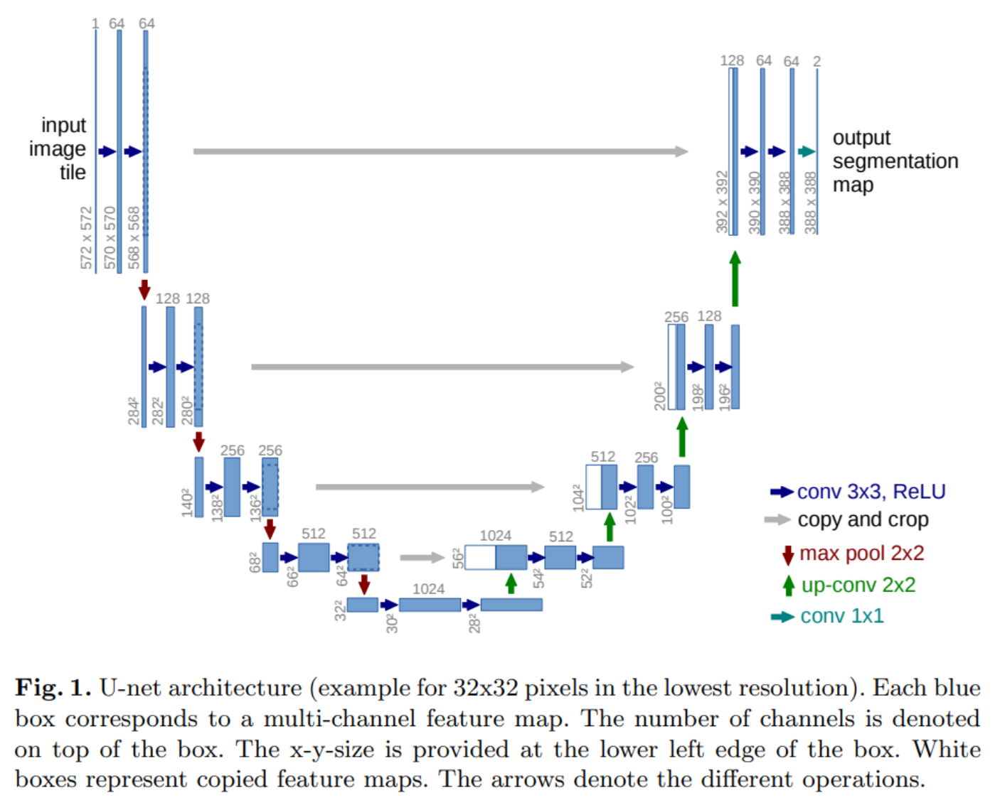
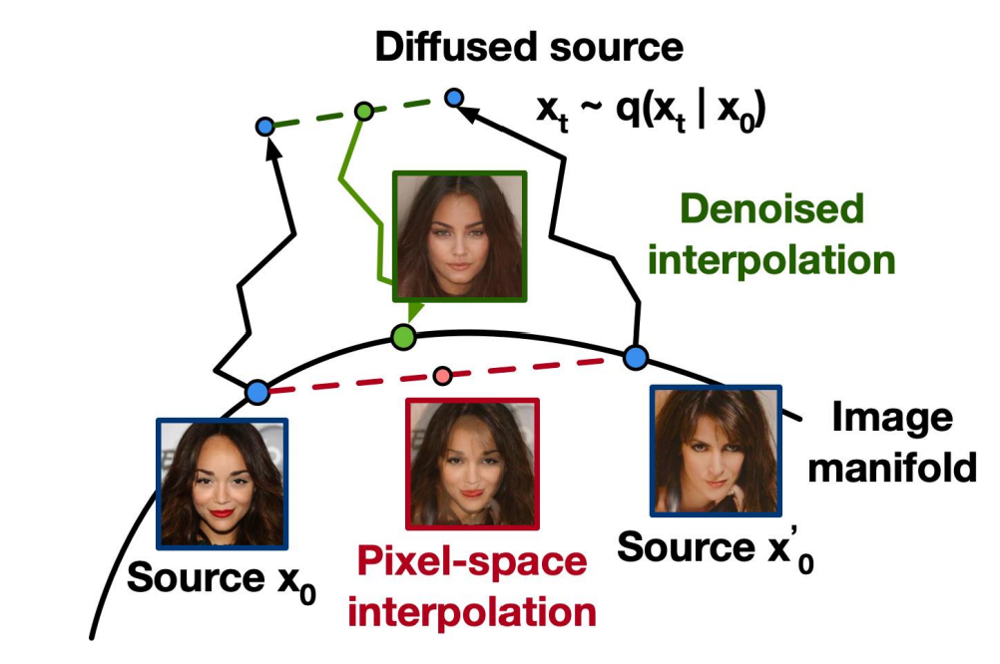
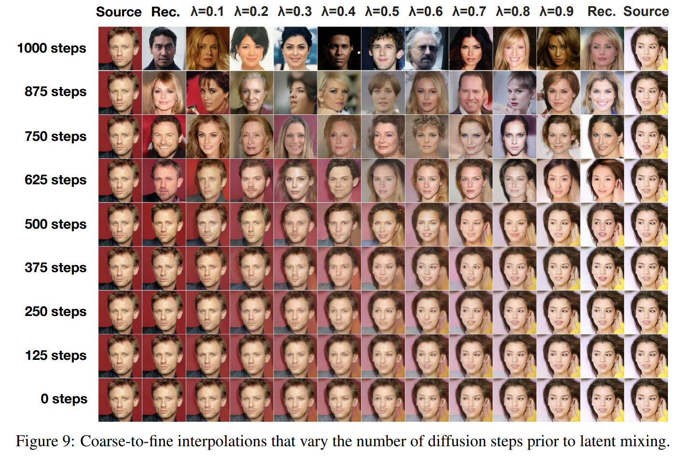

扩散模型最早是由 Sohl-Dickstein 等人在2015年提出的[^1]，其模型定义简单，且训练高效，但是图片生成质量相比其他生成模型仍有差距，本文工作是在此基础上做的进一步改进。**在扩散过程中，如果每一步都添加很小的高斯噪声，那么在反向生成样本时，采样链转换可以设置成条件高斯**。基于此观察，作者提出了一种扩散模型 **参数化** 方法，可以代替 energy based model 里的 denoising score matching 训练和 annealed Langevin dynamics 采样。

##  论文详解

DDPM 分为2个过程：前向扩散过程 (diffusion process) 和反向生成样本过程(reverse process)。

###   diffusion process 

这个过程可以看作是将数据 $$\mathbf{x}_0$$ 转换成隐变量 $$\mathbf{x}_T$$ 的 Markov chain[^2]，在每一步中增加很小的高斯噪声，产生带有噪声的样本 $$\mathbf{x}_1, \dots, \mathbf{x}_T$$。

<figure>
  
  <figcaption>图1：扩散过程可以看作马尔科夫链，在每个时间步上逐步添加噪声.</figcaption>
</figure>

$$
q_\phi(\mathbf{x}_1,\ldots,\mathbf{x}_T \vert \mathbf{x}_0) = \prod^T_{t=1} q_\phi(\mathbf{x}_t \vert \mathbf{x}_{t-1})
$$
式中：
$$
q_\phi(\mathbf{x}_t \vert \mathbf{x}_{t-1}) = \mathcal{N}(\mathbf{x}_t; \sqrt{1 - \beta_t} \mathbf{x}_{t-1}, \beta_t\mathbf{I})
$$
step size 由 variance schedule $$\{\beta_t \in (0, 1)\}_{t=1}^t$$ 控制。

**（1）如何理解 $$q_\phi(\mathbf{x_t} \vert \mathbf{x_{t-1}})$$？**

对  $$q_\phi(\mathbf{x_t} \vert \mathbf{x_{t-1}})$$  reparameterization，可表示为：

$$
\mathbf{x_t} = \sqrt{1-\beta_t}\cdot \mathbf{x_{t-1}} + \sqrt{\beta_t}\cdot \mathbf{z}
$$

式中，$$\mathbf{z}\sim \mathcal{N}(\mathbf{0}, \mathbf{I})$$，$$q_\phi(\mathbf{x_t} \vert \mathbf{x_{t-1}})$$ 的作用是给  $$\mathbf{x_{t-1}}$$ 增加很小的高斯噪声。

随着 step $$t$$ 增加， $$\mathbf{x}_0$$ 逐渐丢失数据特征，当$$T \to \infty$$，$$\mathbf{x}_T$$ 将成为高斯噪声。

令 $$\alpha_t = 1 - \beta_t$$，根据式 10 可得：

$$
\mathbf{x}_1 = \sqrt{\alpha_1}\mathbf{x}_{0} + \sqrt{1 - \alpha_1}\mathbf{z}_{0}
$$

$$
\begin{aligned}
\mathbf{x}_2
& = \sqrt{\alpha_2} \mathbf{x}_{1} + \sqrt{1 - \alpha_2 }{\mathbf{z}}_{1}\\ 
&=\sqrt{\alpha_2}(\sqrt{\alpha_1}\mathbf{x}_{0} + \sqrt{1 - \alpha_1}\mathbf{z}_{0}) + \sqrt{1 - \alpha_2 }{\mathbf{z}}_{1} \\
& = \sqrt{\alpha_1\alpha_2} \mathbf{x}_{0} + \left( \sqrt{\alpha_2 - \alpha_1\alpha_2 }{\mathbf{z}}_{0}+ \sqrt{1 - \alpha_2 }{\mathbf{z}}_{1}\right)\\ 
\end{aligned}\\
$$

因为 $$\mathbf{z}\sim \mathcal{N}(\mathbf{0}, \mathbf{I})$$， 所以：
$$
\begin{aligned}
&\sqrt{\alpha_2 - \alpha_1\alpha_2 }{\mathbf{z}}_{0}\sim \mathcal{N}(\mathbf{0}, (\alpha_2 - \alpha_1\alpha_2)\mathbf{I})\\
&\sqrt{1 - \alpha_2 }{\mathbf{z}}_{1}\sim \mathcal{N}(\mathbf{0}, (1 -\alpha_2)\mathbf{I})
\end{aligned}
$$
2个高斯分布相加依然是高斯分布，所以：
$$
\sqrt{\alpha_2 - \alpha_1\alpha_2 }{\mathbf{z}}_{0}+\sqrt{1 - \alpha_2 }{\mathbf{z}}_{1}\sim \mathcal{N}(\mathbf{0}, (1-\alpha_1\alpha_2)\mathbf{I})
$$
所以：
$$
\begin{aligned}
\mathbf{x}_2= \sqrt{\alpha_1\alpha_2} \mathbf{x}_{0} + \left( \sqrt{1-\alpha_1\alpha_2}{\mathbf{z}}\right)\
\end{aligned}
$$
以此类推
$$
\begin{aligned}
\mathbf{x}_t = \sqrt{\bar{\alpha}_t}\mathbf{x_0} + \sqrt{1 - \bar{\alpha}_t}\mathbf{z} \\
\end{aligned}
$$
式中， $$\bar{\alpha_t} = \prod_{i=1}^T \alpha_i$$

所以当已知初始状态$$\mathbf{x_0}$$，可以采样得到任意step $$t$$ 的 $$\mathbf{x_{t}}$$，上式又可以表示成：
$$
q(\mathbf{x}_t \vert \mathbf{x}_0) = \mathcal{N}(\mathbf{x}_t; \sqrt{\bar{\alpha}_t} \mathbf{x}_0, (1 - \bar{\alpha}_t)\mathbf{I})
$$

**（2）如何理解 variance schedule $$\beta_t$$？**

 $$\beta_t$$ 的取值直接影响到 $$\bar{\alpha}_t$$，它们的关系如下：
$$
\bar{\alpha}_t = \prod_{i=1}^T \alpha_i= \prod_{i=1}^T (1-\beta_i)
$$
根据式34可知，$$\sqrt{\bar{\alpha}_t}$$ 和 $$\sqrt{1 - \bar{\alpha}_t}$$  可以分别看作数据 $$\mathbf{x}_0$$ 的权重和噪声 $$\mathbf{z}$$ 的权重。

通常当样本越接近噪声，可以使用越大的 step size，即$$\beta_1 < \beta_2 < \dots < \beta_T$$， 所以 $$\bar{\alpha}_1 > \dots > \bar{\alpha}_T$$。

如果 $$\beta_t$$ 线性值，则$$\sqrt{\bar{\alpha}_t}$$ 和 $$\sqrt{1 - \bar{\alpha}_t}$$  随着时间步的曲线如下：

    

        图2：variance schedule 的作用是给数据和噪声分配权重
    

     

由上图可知，随着时间步的增加，数据的权重逐步减小，而噪声的权重逐步增大。

所以 $$\beta_t$$ 的作用是给数据和噪声在不同时间步分配权重。

###  reverse process

反向过程可以看作是将数据 latent 变量 $\mathbf{x_T}$ 转换成 $\mathbf{x_0}$ 的Markov chain，在每一步中去除高斯噪声，产生噪声越来越少的样本 $\mathbf{x}_{T-1}, \dots, \mathbf{x}_0$。

    

        图3：反向过程可以看作马尔科夫链，扩散过程正相反，在每个时间步上逐步去除噪声
    

     

如果知道 $q(\mathbf{x_{t-1}}|\mathbf{x_t})$，就可以采样 $\mathbf{x_T}\sim \mathcal{N}(\mathbf{0}, \mathbf{I})$,反向得到 $q(\mathbf{x_0})$，可是 $q(\mathbf{x_{t-1}}|\mathbf{x_t})$依赖于整个数据分布，所以我们需要用神经网络模型 $p_{\theta}$ 来近似：
$$
p_{\theta}(\mathbf{x_0},\ldots,\mathbf{x_{T-1}} \vert \mathbf{x_T}) = \prod^T_{t=1} p_\theta(\mathbf{x_{t-1}} \vert \mathbf{x_{t}}) \quad p_{latent}(\mathbf{x_T})=\mathcal{N}(\mathbf{0}, \mathbf{I})
$$
式中：
$$
p_{\theta}(\mathbf{x_{t-1}} \mid \mathbf{x_{t}}) = \mathcal{N}(\mathbf{x_{t-1}}; \mu_{\theta}(\mathbf{x_{t}},t) ,\sigma_{\theta}(\mathbf{x_{t}},t)^2\mathbf{I}) \quad
$$
当已知 $\mathbf{x_{t}}$ 时， $\mathbf{x_{t-1}}$ 可以表示成：
$$
\mathbf{x_{t-1}} =\mu_{\theta}(\mathbf{x_{t}},t) + \sigma_{\theta}(\mathbf{x_{t}},t)\cdot \mathbf{z}
$$
函数 $p_{\theta}(\mathbf{x_{t-1}}\mid \mathbf{x_{t}}) $作用是去除高斯噪声，输入高斯噪声图片 $\mathbf{x_T}$，其将逐步还原成图片 $\mathbf{x_{0}}$。

###  模型训练

给定数据 $\mathbf{x_0}$ ，喂给模型后，希望其发生概率 $p_θ(\mathbf{x_0})$ 越大越好，其等同于让 $ \text{ELBO}$ 越大越好：
$$
\begin{aligned}
\log p_{\theta}(\mathbf{x}_0) 
&\geq  \log p_\theta(\mathbf{x}_0) - D_\text{KL}(q(\mathbf{x}_{1:T}\vert\mathbf{x}_0) \| p_\theta(\mathbf{x}_{1:T}\vert\mathbf{x}_0) ) \\
&= \log p_\theta(\mathbf{x}_0) - \mathbb{E}_{\mathbf{x}_{1:T}\sim q(\mathbf{x}_{1:T} \vert \mathbf{x}_0)} \Big[ \log\frac{q(\mathbf{x}_{1:T}\vert\mathbf{x}_0)}{p_\theta(\mathbf{x}_{0:T}) / p_\theta(\mathbf{x}_0)} \Big] \\
&= \log p_\theta(\mathbf{x}_0) - \mathbb{E}_q \Big[ \log\frac{q(\mathbf{x}_{1:T}\vert\mathbf{x}_0)}{p_\theta(\mathbf{x}_{0:T})} + \log p_\theta(\mathbf{x}_0) \Big] \\
&= -\mathbb{E}_q \Big[ \log \frac{q(\mathbf{x}_{1:T}\vert\mathbf{x}_0)}{p_\theta(\mathbf{x}_{0:T})} \Big]:=\text { ELBO}
\end{aligned}
$$
现在优化目标是让 $-\text{ELBO}$ 越小越好，可以进一步转换为[^3]：
$$
\begin{aligned}
\mathcal{L}=-\text { ELBO}
&= \mathbb{E}_{q(\mathbf{x}_{0:T})} \Big[ \log\frac{q(\mathbf{x}_{1:T}\vert\mathbf{x}_0)}{p_\theta(\mathbf{x}_{0:T})} \Big] \\
&= \mathbb{E}_q \Big[ \log\frac{\prod_{t=1}^T q(\mathbf{x}_t\vert\mathbf{x}_{t-1})}{ p_\theta(\mathbf{x}_T) \prod_{t=1}^T p_\theta(\mathbf{x}_{t-1} \vert\mathbf{x}_t) } \Big] \\
&= \mathbb{E}_q \Big[ -\log p_\theta(\mathbf{x}_T) + \sum_{t=1}^T \log \frac{q(\mathbf{x}_t\vert\mathbf{x}_{t-1})}{p_\theta(\mathbf{x}_{t-1} \vert\mathbf{x}_t)} \Big] \\
&= \mathbb{E}_q \Big[ -\log p_\theta(\mathbf{x}_T) + \sum_{t=2}^T \log \frac{q(\mathbf{x}_t\vert\mathbf{x}_{t-1})}{p_\theta(\mathbf{x}_{t-1} \vert\mathbf{x}_t)} + \log\frac{q(\mathbf{x}_1 \vert \mathbf{x}_0)}{p_\theta(\mathbf{x}_0 \vert \mathbf{x}_1)} \Big] \\
&= \mathbb{E}_q \Big[ -\log p_\theta(\mathbf{x}_T) + \sum_{t=2}^T \log \Big( \frac{q(\mathbf{x}_{t-1} \vert \mathbf{x}_t, \mathbf{x}_0)}{p_\theta(\mathbf{x}_{t-1} \vert\mathbf{x}_t)}\cdot \frac{q(\mathbf{x}_t \vert \mathbf{x}_0)}{q(\mathbf{x}_{t-1}\vert\mathbf{x}_0)} \Big) + \log \frac{q(\mathbf{x}_1 \vert \mathbf{x}_0)}{p_\theta(\mathbf{x}_0 \vert \mathbf{x}_1)} \Big] \\
&= \mathbb{E}_q \Big[ -\log p_\theta(\mathbf{x}_T) + \sum_{t=2}^T \log \frac{q(\mathbf{x}_{t-1} \vert \mathbf{x}_t, \mathbf{x}_0)}{p_\theta(\mathbf{x}_{t-1} \vert\mathbf{x}_t)} + \sum_{t=2}^T \log \frac{q(\mathbf{x}_t \vert \mathbf{x}_0)}{q(\mathbf{x}_{t-1} \vert \mathbf{x}_0)} + \log\frac{q(\mathbf{x}_1 \vert \mathbf{x}_0)}{p_\theta(\mathbf{x}_0 \vert \mathbf{x}_1)} \Big] \\
&= \mathbb{E}_q \Big[ -\log p_\theta(\mathbf{x}_T) + \sum_{t=2}^T \log \frac{q(\mathbf{x}_{t-1} \vert \mathbf{x}_t, \mathbf{x}_0)}{p_\theta(\mathbf{x}_{t-1} \vert\mathbf{x}_t)} + \log\frac{q(\mathbf{x}_T \vert \mathbf{x}_0)}{q(\mathbf{x}_1 \vert \mathbf{x}_0)} + \log \frac{q(\mathbf{x}_1 \vert \mathbf{x}_0)}{p_\theta(\mathbf{x}_0 \vert \mathbf{x}_1)} \Big]\\
&= \mathbb{E}_q \Big[ \log\frac{q(\mathbf{x}_T \vert \mathbf{x}_0)}{p_\theta(\mathbf{x}_T)} + \sum_{t=2}^T \log \frac{q(\mathbf{x}_{t-1} \vert \mathbf{x}_t, \mathbf{x}_0)}{p_\theta(\mathbf{x}_{t-1} \vert\mathbf{x}_t)} - \log p_\theta(\mathbf{x}_0 \vert \mathbf{x}_1) \Big] \\
&= \mathbb{E}_q [\underbrace{D_\text{KL}(q(\mathbf{x}_T \vert \mathbf{x}_0) \parallel p_\theta(\mathbf{x}_T))}_{\mathcal{L}_T} + \sum_{t=2}^T \underbrace{D_\text{KL}(q(\mathbf{x}_{t-1} \vert \mathbf{x}_t, \mathbf{x}_0) \parallel p_\theta(\mathbf{x}_{t-1} \vert\mathbf{x}_t))}_{\mathcal{L}_{t-1}} \underbrace{- \log p_\theta(\mathbf{x}_0 \vert \mathbf{x}_1)}_{\mathcal{L}_0} ]
\end{aligned}
$$
$\mathcal{L_T}$  与模型参数 $\theta$ 无关，可以忽略 ；$\mathcal{L_0}$ 是重构损失项 ；$\mathcal{L_{t−1}}$ 是与高斯分布之间的 KL divergences。

下面着重分析 $\mathcal{L_{t−1}}$ ，其是关于 $q\left(\mathbf{x_{t-1}} \mid \mathbf{x_{t}}, \mathbf{x_{0}}\right)$ 和  $p_{\theta}(\mathbf{x_{t-1}} \mid \mathbf{x_{t}})$ KL散度：

**（1）$q\left(\mathbf{x_{t-1}} \mid \mathbf{x_{t}}, \mathbf{x_{0}}\right)$**

根据Bayes rule：
$$
\begin{equation}\begin{aligned}
q\left(\mathbf{x}_{t-1} \mid \mathbf{x}_{t}, \mathbf{x}_{0}\right)=& \frac{q\left(\mathbf{x}_{t} \mid \mathbf{x}_{t-1}\right) q\left(\mathbf{x}_{t-1} \mid \mathbf{x}_{0}\right)}{q\left(\mathbf{x}_{t} \mid \mathbf{x}_{0}\right)} \\
=& \frac{\mathcal{N}\left(\mathbf{x}_{t} ; \sqrt{\alpha_{t}} \mathbf{x}_{t-1}, \beta_{t} I\right) \mathcal{N}\left(\mathbf{x}_{t-1} ; \sqrt{\bar{\alpha}_{t-1}} \mathbf{x}_{0},\left(1-\bar{\alpha}_{t-1}\right) I\right)}{\mathcal{N}\left(\mathbf{x}_{t} ; \sqrt{\bar{\alpha}_{t}} \mathbf{x}_{0},\left(1-\bar{\alpha}_{t}\right) I\right)} \\
=&\left(2 \pi \beta_{t}\right)^{-\frac{d}{2}}\left(2 \pi\left(1-\bar{\alpha}_{t-1}\right)\right)^{-\frac{d}{2}}\left(2 \pi\left(1-\bar{\alpha}_{t}\right)\right)^{\frac{d}{2}} \times \\
& \exp \left(-\frac{\left\|\mathbf{x}_{t}-\sqrt{\alpha_{t}} \mathbf{x}_{t-1}\right\|^{2}}{2 \beta_{t}}-\frac{\left\|\mathbf{x}_{t-1}-\sqrt{\bar{\alpha}_{t-1}} \mathbf{x}_{0}\right\|^{2}}{2\left(1-\bar{\alpha}_{t-1}\right)}+\frac{\left\|\mathbf{x}_{t}-\sqrt{\bar{\alpha}_{t}} x_{0}\right\|^{2}}{2\left(1-\bar{\alpha}_{t}\right)}\right) \\
=&\left(2 \pi \tilde{\beta}_{t}\right)^{-\frac{d}{2}} \exp \left(-\frac{1}{2 \tilde{\beta}_{t}}\left\|\mathbf{x}_{t-1}-\left( \frac{\sqrt{\bar{\alpha}_{t-1}} \beta_{t}}{1-\bar{\alpha}_{t}} \mathbf{x}_{0}+\frac{\sqrt{\alpha_{t}}\left(1-\bar{\alpha}_{t-1}\right)}{1-\bar{\alpha}_{t}} \mathbf{x}_{t}\right) \right\|^{2}\right)
\end{aligned}\end{equation}
$$
所以：
$$
q\left(\mathbf{x}_{t-1} \mid \mathbf{x}_{t}, \mathbf{x}_{0}\right)=\mathcal{N}\left(\mathbf{x}_{t-1} ; \frac{\sqrt{\bar{\alpha}_{t-1}} \beta_{t}}{1-\bar{\alpha}_{t}} \mathbf{x}_{0}+\frac{\sqrt{\alpha_{\iota}}\left(1-\bar{\alpha}_{
t-1}\right)}{1-\bar{\alpha}_{t}} \mathbf{x}_{t}, \tilde{\beta}_{t} I\right)
$$
上式可以表示成：
$$
q\left(\mathbf{x}_{t-1} \mid \mathbf{x}_{t}, \mathbf{x}_{0}\right)=\mathcal{N}\left(\mathbf{x}_{t-1} ; \tilde{\boldsymbol{\mu}}_{t}\left(\mathbf{x}_{t}, \mathbf{x}_{0}\right), \tilde{\beta}_{t} \mathbf{I}\right)
$$
式中：
$$
\tilde{\boldsymbol{\mu}_{t}}\left(\mathbf{x_{t}}, \mathbf{x_{0}}\right)=\frac{\sqrt{\bar{\alpha}_{t-1}} \beta_{t}}{1-\bar{\alpha}_{t}} \mathbf{x_{0}}+\frac{\sqrt{\alpha_{t}}\left(1-\bar{\alpha}_{t-1}\right)}{1-\bar{\alpha}_{t}} \mathbf{x_{t}}\\
\tilde{\beta}_{t}=\frac{1-\bar{\alpha}_{t-1}}{1-\bar{\alpha}_{t}} \beta_{t}
$$

因为 ：
$$
\mathbf{x_t} = \sqrt{\bar{\alpha}_t}\mathbf{x_0} + \sqrt{1 - \bar{\alpha}_t}\mathbf{z}
$$
所以 :
$$
\mathbf{x_0} =  \frac{\mathbf{x_t}-\sqrt{1 - \bar{\alpha}_t}\mathbf{z}}{\sqrt{\bar{\alpha_t}}}
$$
将 $\mathbf{x_0}$ 代入 $\tilde{\mu_{t}}$ 可进一步得：
$$
\tilde{\boldsymbol{\mu}}_{t}\left(\mathbf{x_{t}}, t\right)=\frac{1}{\sqrt{\alpha_{t}}}\left(\mathbf{x_{t}}-\frac{\beta_{t}}{\sqrt{1-\bar{\alpha}_{t}}} \mathbf{z}\right)
$$
 **（2） $p_\theta(\mathbf{x_{t-1}} \mid \mathbf{x_{t}})$** 
$$
p_\theta(\mathbf{x}_{t-1} \mid \mathbf{x}_{t}) = \mathcal{N}(\mathbf{x}_{t-1}; \mu_{\theta}(\mathbf{x}_{t},t) ,\sigma_{\theta}(\mathbf{x}_{t},t)^2\mathbf{I}) \quad
$$
**为做简化，将$\sigma_{\theta}(\mathbf{x_{t}},t)^2$ 设置成时间相关但是不用学习的参数，即 $\sigma^2_{t}$**。

一般将 $\sigma_{t}^2$ 设置成 $\beta_{t}$ 或者 $\tilde{\beta_{t}}$ 。

注意到 $\mu_θ$ 是为了预测 $\tilde{\mu_{t}}$，又因为 $\mathbf{x_{t}}$ 是作为已知项输入给模型的，所以可以将 $\mu_{θ}$ 参数化为：
$$
{\mu}_{\theta}\left(\mathbf{x_{t}}, t\right)=\frac{1}{\sqrt{\alpha_{t}}}\left(\mathbf{x_{t}}-\frac{\beta_{t}}{\sqrt{1-\bar{\alpha}_{t}}} \mathbf{z}_\theta(\mathbf{x_t},t)\right)
$$
**上式中的$\mathbf{z_\theta}$ 就是需要学习的神经网络模型** ，下面继续推导模型 $\mathbf{z_\theta}$ 的优化目标：

因为 $q(\mathbf{x_{t-1}} \vert \mathbf{x_t}, \mathbf{x_0})$ 和 $p_\theta(\mathbf{x_{t-1}} \vert \mathbf{x_t}) $ 都是高斯分布，并且有着同样的 `covariance matirx` $\tilde{\beta_{t}}I$，所以它们的 KL divergence 是均值的 $l2$ 距离的$\frac{1}{2\tilde{\beta_{t}}}$倍，即：

$$
\begin{aligned}
& D_{KL}\left(q\left(\mathbf{x}_{t-1} \mid \mathbf{x}_{t}, \mathbf{x}_{0}\right) \| p_{\theta}\left(\mathbf{x}_{t-1} \mid \mathbf{x}_{t}\right)\right) \\
&=\frac{1}{2 \tilde{\beta}_{t}} \mathbb{E}_{\mathbf{x}_{0}}\left\|\frac{\sqrt{\bar{\alpha}_{t-1}} \beta_{t}}{1-\bar{\alpha}_{t}} \mathbf{x}_{0}+\frac{\sqrt{\alpha_{t}}\left(1-\bar{\alpha}_{t-1}\right)}{1-\bar{\alpha}_{t}} \mathbf{x}_{t}-\frac{1}{\sqrt{\alpha_{t}}}\left(\mathbf{x}_{t}-\frac{\beta_{t}}{\sqrt{1-\bar{\alpha}_{t}}} \mathbf{z}_{\theta}\left(\mathbf{x}_{t}, t\right)\right)\right\|^{2} \\
&=\frac{1}{2 \tilde{\beta}_{t}} \mathbb{E}_{\mathbf{x}_{0}, \epsilon}\left\|\frac{\sqrt{\bar{\alpha}_{t-1}} \beta_{t}}{1-\bar{\alpha}_{t}} \cdot \frac{\mathbf{x}_{t}-\sqrt{1-\bar{\alpha}_{t}} \epsilon}{\sqrt{\bar{\alpha}_{t}}}+\frac{\sqrt{\alpha_{t}}\left(1-\bar{\alpha}_{t-1}\right)}{1-\bar{\alpha}_{t}} \mathbf{x}_{t}-\frac{1}{\sqrt{\alpha_{t}}}\left(\mathbf{x}_{t}-\frac{\beta_{t}}{\sqrt{1-\bar{\alpha}_{t}}} \mathbf{z}_{\theta}\left(\mathbf{x}_{t}, t\right)\right)\right\|^{2} \\
&=\frac{1}{2 \tilde{\beta}_{t}} \cdot \frac{\beta_{t}^{2}}{\alpha_{t}\left(1-\bar{\alpha}_{t}\right)} \mathbb{E}_{\mathbf{x}_{0}, \epsilon}\left\|0 \cdot \mathbf{x}_{t}+\epsilon-\mathbf{z}_{\theta}\left(\mathbf{x}_{t}, t\right)\right\|^{2} \\
&=\frac{\beta_{t}^{2}}{2 \frac{1-\bar{\alpha}_{t-1}}{1-\bar{\alpha}_{t}} \beta_{t} \alpha_{t}\left(1-\bar{\alpha}_{t}\right)} \mathbb{E}_{\mathbf{x}_{0}, \epsilon}\left\|\epsilon-\mathbf{z}_{\theta}\left(\mathbf{x}_{t}, t\right)\right\|^{2} \\
&=\frac{\beta_{t}}{2 \alpha_{t}\left(1-\bar{\alpha}_{t-1}\right)} \mathbb{E}_{\mathbf{x}_{0}, \epsilon}\left\|\epsilon-\mathbf{z}_{\theta}\left(\mathbf{x}_{t}, t\right)\right\|^{2}\\
&=\frac{\beta_{t}}{2 \alpha_{t}\left(1-\bar{\alpha}_{t-1}\right)} \mathbb{E}_{\mathbf{x}_{0}, \epsilon}\left\|\epsilon-\mathbf{z}_{\theta}\left(\sqrt{\bar{\alpha}_t}\mathbf{x}_0 + \sqrt{1 - \bar{\alpha}_t}\mathbf{\epsilon}, t\right)\right\|^{2}\\

\end{aligned}
$$

Ho et al.[^2]发现忽略上式的权重项，可以得到更好的训练效果，学习目标可以简化为：
$$
L_t^\text{simple} = \mathbb{E}_{\mathbf{x}_{0}, \epsilon}\left\|\epsilon-\mathbf{z}_{\theta}\left(\sqrt{\bar{\alpha}_t}\mathbf{x}_0 + \sqrt{1 - \bar{\alpha}_t}\mathbf{\epsilon}, t\right)\right\|^{2}
$$

至于 $\mathcal{L_0}$ 重构损失，因为：
$$
\mathbf{x}_{1}=\sqrt{\bar{\alpha}_{1}} \mathbf{x}_{0}+\sqrt{1-\bar{\alpha}{ }_{1}} \epsilon=\sqrt{\alpha_{1}} x_{0}+\sqrt{1-\alpha_{1}} \epsilon
$$

所以 $\mathcal{L_0}$ 又可以表示成：
$$
\begin{aligned}
\mathbb{E}_{q} \log p_{\theta}\left(\mathbf{x}_{0} \mid \mathbf{x}_{1}\right) &=\mathbb{E}_{q} \log \mathcal{N}\left(\mathbf{x}_{0} ; \frac{1}{\sqrt{\alpha_{1}}}\left(\mathbf{x}_{1}-\frac{\beta_{1}}{\sqrt{1-\alpha_{1}}} \mathbf{z}_{\theta}\left(\mathbf{x}_{1}, 1\right)\right), \beta_{1} I\right) \\
&=\mathbb{E}_{q}\left(-\frac{d}{2} \log 2 \pi \beta_{1}-\frac{1}{2 \beta_{1}}\left\|\mathbf{x}_{0}-\frac{1}{\sqrt{\alpha_{1}}}\left(\mathbf{x}_{1}-\frac{\beta_{1}}{\sqrt{1-\alpha_{1}}} \mathbf{z}_{\theta}\left(\mathbf{x}_{1}, 1\right)\right)\right\|^{2}\right) \\
&=-\frac{d}{2} \log 2 \pi \beta_{1}-\frac{1}{2 \beta_{1}} \mathbb{E}_{\mathbf{x}_{0}, \epsilon}\left\|\mathbf{x}_{0}-\frac{1}{\sqrt{\alpha_{1}}}\left(\sqrt{\alpha_{1}} \mathbf{x}_{0}+\sqrt{1-\alpha_{1}} \epsilon-\frac{\beta_{1}}{\sqrt{1-\alpha_{1}}} \mathbf{z}_{\theta}\left(\mathbf{x}_{1}, 1\right)\right)\right\|^{2} \\
&=-\frac{d}{2} \log 2 \pi \beta_{1}-\frac{1}{2 \beta_{1}} \mathbb{E}_{\mathbf{x}_{0}, \epsilon}\left\|\frac{\sqrt{\beta_{1}}}{\sqrt{\alpha_{1}}}\left(\epsilon-\mathbf{z}_{\theta}\left(\mathbf{x}_{1}, 1\right)\right)\right\|^{2} \\
&=-\frac{d}{2} \log 2 \pi \beta_{1}-\frac{1}{2 \alpha_{1}} \mathbb{E}_{\mathbf{x}_{0}, \epsilon}\left\|\epsilon-\mathbf{z}_{\theta}\left(\mathbf{x}_{1}, 1\right)\right\|^{2}
\end{aligned}
$$

与模型相关的只有一项 $\mathbf{z_{\theta}}\left(\mathbf{x_{1}}, 1\right)$，即在时间步1时的预测值。

经过上述推导，最后 DDPM 的优化目标可以表示成：
$$
L_\text{simple} = L_t^\text{simple} + C
$$
式中 $C$是不依赖于 $\theta$ 的常数。

###  生成样本

当学习得到模型 $\mathbf{z_\theta}$之后，可以使用它来生成样本，对每个时间步按照下式迭代：

$$
\begin{aligned}
\mathbf{x_{t-1}} 
&=\mu_{\theta}(\mathbf{x}_{t},t) + \sigma_{\theta}(\mathbf{x}_{t},t)\cdot \mathbf{z}\\
&=\frac{1}{\sqrt{\alpha_{t}}}\left(\mathbf{x}_{t}-\frac{\beta_{t}}{\sqrt{1-\bar{\alpha}_{t}}} \cdot\mathbf{z}_\theta(\mathbf{x}_{t},t)\right)+ \sigma_{t}\cdot \mathbf{z}\\
&=\frac{1}{\sqrt{\alpha_{t}}}\left(\mathbf{x}_{t}-\frac{1-\alpha_{t}}{\sqrt{1-\bar{\alpha}_{t}}}\cdot \mathbf{z}_\theta(\mathbf{x}_{t},t)\right)+ \sigma_{t}\cdot \mathbf{z}
\end{aligned}
$$

综上，DDPM的训练和采样具体步骤如下[^2]：

##  实验结果

神经网络模型使用 PixelCNN++ 的 backbone，即基于 Wide ResNet 的 U-Net，为了更方便的实施，将 weight normalization 替换成 group normalization。

    

        图4：U-Net网络架构
    

     

在我们的32 × 32 的模型使用了4个特征尺度（32 × 32 到 4 × 4），而 256 × 256 模型使用了6个特征尺度。不同的分辨率下，有2个卷积残差块，在 16 × 16 的分辨率下，连个卷积残差块中间增加一个 self-attention 模块。

时间步 $t$ 通过 Transformer sinusoidal position embedding 加到每个残差块里。

现在，让我们来看看实验结果。

###  图片生成质量

在 CIFAR10 数据集上， 在训练集上，无条件模型 FID 分数达到 3.17；在测试集上 FID 分数为5.24，图片质量超过其他模型。

以下是在 LSUN 数据集中学习和生成的图像，非常漂亮。

    

        图5： LSUN 数据集图片生成质量
    

     

###  损失函数比较

接下来，我们将讨论简化损失函数的影响，结果如下表：

- 如果预测 $\tilde {\mu}$ ，只有当使用 variational bound 损失函数时才有效，而不能使用 MSE。

- 反向过程的 variances $\sigma_{\theta}(\mathbf{x_{t}},t)$ 如果设置成可学习的，会让训练过程不稳定，并且相比固定的 variances 效果更差。

- 如果预测 $\epsilon$ ，可以和使用固定的 variances，并且通过 variational bound 学习 $\tilde{\mu}$  得到的效果相媲美，同时它可以使用简化的目标函数训练。

###  图像生成过程

图像生成时，会首先生成大尺度特征，再逐步生成图像细节。如下图所示，最初是随机噪声（最左侧），随着时间步长的增加，逐渐看到模糊的整体图像，最后细节越来越清晰。

    

        图6： CIFAR 10 图像生成过程
    

     

###  共享潜在变量

Share $\mathbf{x_{1000}}$ 最左侧有四个图像，这是通过共享四个图像中的右下角  $\mathbf{x_{1000}}$ 生成的图像。因此，它由相同的噪声生成，但会产生完全不同的图像。

另一方面，Share  $\mathbf{x_{750}}$ 和左侧的第二个图像是从同一  $\mathbf{x_{750}}$ 生成的图像，虽然有点不同，但他们普遍都戴着太阳镜，此外，500 和 250 会产生类似的效果。

    

        图7： 共享潜在变量的效果
    

     

###  图像插值

首先将随机采样2张 source 图片，$\mathbf{x_{0}},\mathbf{x_{0}'}\sim q(\mathbf{x_{0}})$，然后通过正向扩散，将图片 encoder到隐空间中，即 $\mathbf{x_{t}},\mathbf{x_{t}'}\sim q(\mathbf{x_{t}}\mid \mathbf{x_{0}})$，随后在隐空间中插值（此处对论文公式做了修改）：
$$
\bar{\mathbf{x_t}}=(1-\lambda)\mathbf{x_t}+\lambda\mathbf{x_t'}
$$
再通过反向过程将隐空间中插值 decoder 到图像空间上： $\bar{\mathbf{x_{0}}}\sim p(\mathbf{x_{0}}\mid \mathbf{\bar{x_{t}}})$

    

        图8： 图像插值过程
    

     

下图显示了不同时间步的隐空间插值和不同 $\lambda$ 的效果，产生这种效果的个人理解：

（1）$\lambda$ 越大，隐变量值越接近最右边的 source，所以decoder 到图像空间上，也更像右边的source；

（2）时间步 $t$ 越大，在 encoder 时，往图片中添加的噪声越多，图片信息丢失越严重，最极端的情况是完全变成了高斯噪声，此时再 decoder 回来，由于随机性得到的图像与原图像差异会很大，这也解释了为什么1000 steps时，产生了更加多样的图片；另外时间步越大，可以产生更加细节的内容，这也在下图有很好的展现。

    

        图9：不同时间步和λ的图像插值效果
    

     

##  参考

[^1]:Jascha Sohl-Dickstein et al. [“Deep Unsupervised Learning using Nonequilibrium Thermodynamics.”](https://arxiv.org/abs/1503.03585) ICML 2015.
[^2]: Jonathan Ho et al. [“Denoising diffusion probabilistic models.”](https://arxiv.org/abs/2006.11239) arxiv:2006.11239 (2020). [[code](https://github.com/hojonathanho/diffusion)]
[^3]: Lil'Log. [What are Diffusion Models? ](https://lilianweng.github.io/posts/2021-07-11-diffusion-models/)
